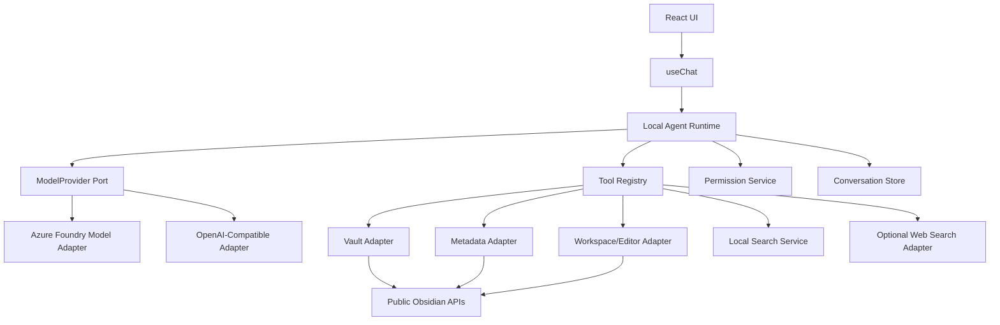

# Notalith Design

## 1. Summary

Notalith is a desktop- and mobile-compatible Obsidian plugin that connects large language models to the current Obsidian vault through public Obsidian APIs.

The first implementation uses a **direct model connection with a local tool loop**:

```text
Obsidian UI
    |
    v
Local agent runtime inside the plugin
    |                         |
    |                         +--> Obsidian tools
    |                              - read/search notes
    |                              - read embedded images
    |                              - edit/create/move files
    |                              - inspect links/tags/frontmatter
    |
    +--> Model provider adapter
         - Azure Foundry / Azure OpenAI Responses API
         - optional OpenAI-compatible providers
```

The plugin must not require Node.js, a local CLI, `child_process`, Electron APIs, or an ACP process for its core feature set. This allows the same architecture to run in Obsidian Desktop, iOS, and Android.

> [!important] Product boundary
> Notalith directly connects to a model deployment and executes Obsidian tools locally. Azure Foundry Prompt Agent and Hosted Agent integrations may be added later as alternative remote runtimes, but they are not required for the initial architecture.

## 2. Goals

### 2.1 Primary goals

1. Support Obsidian Desktop, iOS, and Android from one codebase.
2. Expose useful public Obsidian APIs to an LLM through explicit, typed tools.
3. Read Markdown notes, metadata, links, selections, images, and supported attachments from the current vault.
4. Safely create, edit, move, rename, and delete vault content with user approval.
5. Support multimodal models by sending Vault images as image input.
6. Support Azure Foundry model deployments, initially through the Azure OpenAI Responses API.
7. Stream model responses and tool activity into an Obsidian-native chat UI.
8. Keep model-provider logic independent from Vault and UI logic.
9. Preserve user control through permissions, previews, limits, and audit history.
10. Avoid private or undocumented Obsidian APIs.

### 2.2 Secondary goals

1. Allow optional web search without requiring the selected model to provide native search.
2. Support local semantic search over the vault.
3. Support OpenAI-compatible endpoints through the same provider abstraction.
4. Support exportable conversations and reusable project context.
5. Provide a future path to Foundry Prompt Agents, Foundry Hosted Agents, MCP, and remote ACP.

## 3. Non-goals

The initial version will not:

- Start Copilot CLI, OpenCode, Claude Code, Codex, or another local process.
- Implement ACP on mobile.
- Provide a shell or unrestricted code execution tool.
- Expose the entire filesystem outside the current vault.
- Invoke undocumented APIs from other Obsidian plugins.
- Upload the whole vault automatically.
- Require Azure Foundry Agent Service.
- Treat a model deployment as trusted code.
- Automatically approve destructive or external actions.
- Implement OneDrive or SharePoint access outside files already present in the vault.

## 4. Target platforms

| Platform         | Core chat | Vault tools | Image input |       Local semantic search |       Local process/ACP |
| ---------------- | --------: | ----------: | ----------: | --------------------------: | ----------------------: |
| Obsidian Desktop |       Yes |         Yes |         Yes |                         Yes | Optional future feature |
| Obsidian iOS     |       Yes |         Yes |         Yes | Yes, within resource limits |                      No |
| Obsidian Android |       Yes |         Yes |         Yes | Yes, within resource limits |                      No |

This is one platform-neutral implementation, not separate desktop, iOS, and Android architectures. The same services call the same public Obsidian APIs on every platform. Service boundaries isolate the Obsidian SDK for testing and maintainability; they are not operating-system adapter layers. Platform differences are compatibility constraints covered by capability checks and the test matrix below.

Core code must use Obsidian abstractions such as `Vault`, `MetadataCache`, `Workspace`, `Editor`, `FileManager`, `requestUrl`, and `SecretStorage`. It must not use:

- `child_process`
- Node.js `fs`
- Node.js `path`
- Electron
- `process.platform`
- absolute operating-system paths

## 5. User experience

### 5.1 Main chat

The chat view contains:

- Conversation history.
- Streaming assistant output.
- Tool-call cards with status and result summaries.
- Permission prompts.
- Text input.
- Note, folder, image, and file context attachments.
- Model and deployment selector.
- Stop-generation button.
- Context usage and estimated cost indicators when available.

### 5.2 Context selection

Users can provide context through:

- `@` mention of a note.
- `@` mention of a folder.
- Current note.
- Current editor selection.
- Drag-and-drop from the Vault file explorer.
- Paste or drag-and-drop of an image.
- Embedded images referenced by an attached Markdown note.
- Explicit semantic search results.

No note or attachment is sent merely because it is open. The user must attach it, enable an explicit context option, or approve a tool call that reads it.

### 5.3 Inline actions

The plugin provides commands for:

- Ask about selection.
- Explain selection.
- Summarize selection.
- Rewrite selection.
- Insert response below selection.
- Replace selection after preview.
- Ask about the current note.
- Attach current note to chat.
- Open a new chat.

### 5.4 Write review

Before applying a write, the UI shows:

- Target path.
- Operation type.
- Diff for text changes.
- Existing and proposed frontmatter.
- Conflict warning when the file changed after the tool read it.
- Approve once, approve for session, reject, and edit proposal actions.

Delete, overwrite, rename, move, and binary modification always require explicit approval in the initial release.

## 6. Architecture



### 6.1 Architectural layers

```text
src/
  domain/
    models/
    ports/
    tools/
  providers/
    azure-foundry/
    openai-compatible/
  obsidian/
    vault.adapter.ts
    metadata.adapter.ts
    workspace.adapter.ts
    secret-storage.adapter.ts
  services/
    local-agent-runtime.ts
    context-builder.ts
    embed-resolver.ts
    image-service.ts
    permission-service.ts
    conversation-store.ts
    semantic-search.ts
    web-search.ts
  hooks/
    useChat.ts
    useAgentRuntime.ts
    useAttachments.ts
    usePermissions.ts
    useSettings.ts
  ui/
    ChatView.tsx
    ChatPanel.tsx
    MessageList.tsx
    InputArea.tsx
    ToolCallCard.tsx
    PermissionDialog.tsx
    SettingsTab.ts
  plugin.ts
  main.ts
```

### 6.2 Layer rules

- `domain/**` has no dependency on Obsidian, React, Azure SDKs, or provider SDKs.
- `providers/**` implements model-provider ports and never accesses the Vault directly.
- `obsidian/**` isolates Obsidian API usage.
- `services/**` contains provider-independent orchestration and pure transformations.
- React hooks own UI state and compose services.
- Components render state and do not contain provider or Vault business logic.
- Tool schemas and tool implementations are separate.

## 7. Core domain contracts

### 7.1 Model provider

```ts
interface ModelProvider {
  readonly id: string;

  testConnection(signal?: AbortSignal): Promise<ConnectionTestResult>;

  streamResponse(
    request: ModelRequest,
    handlers: ModelStreamHandlers,
    signal?: AbortSignal,
  ): Promise<ModelResponse>;
}
```

The normalized request supports:

- System instructions.
- Conversation items.
- Text input.
- Image input.
- Tool definitions.
- Tool results.
- Streaming.
- Model/deployment selection.
- Reasoning configuration when supported.
- Maximum output limits.

Provider-specific response events are converted to:

```ts
type AgentEvent =
  | { type: "text_delta"; text: string }
  | { type: "reasoning_delta"; text: string }
  | { type: "tool_call"; call: ToolCall }
  | { type: "usage"; usage: TokenUsage }
  | { type: "completed"; responseId: string }
  | { type: "error"; error: AgentError };
```

### 7.2 Vault access

```ts
interface VaultAccess {
  getFile(path: string): Promise<VaultFile | null>;
  listFiles(path?: string): Promise<VaultFile[]>;
  listMarkdownFiles(): Promise<VaultFile[]>;
  readText(path: string): Promise<TextFileContent>;
  readBinary(path: string): Promise<BinaryFileContent>;
  createText(path: string, content: string): Promise<VaultFile>;
  createBinary(path: string, content: ArrayBuffer): Promise<VaultFile>;
  modifyText(
    path: string,
    content: string,
    expectedMtime?: number,
  ): Promise<VaultFile>;
  rename(path: string, newPath: string): Promise<void>;
  copy(path: string, newPath: string): Promise<VaultFile>;
  delete(path: string, useTrash: boolean): Promise<void>;
}
```

### 7.3 Metadata access

```ts
interface MetadataAccess {
  getFileMetadata(path: string): Promise<FileMetadata | null>;
  resolveLink(link: string, sourcePath: string): Promise<VaultFile | null>;
  getOutgoingLinks(path: string): Promise<LinkReference[]>;
  getBacklinks(path: string): Promise<LinkReference[]>;
  getUnresolvedLinks(path: string): Promise<LinkReference[]>;
  getTags(path: string): Promise<string[]>;
  getFrontmatter(path: string): Promise<Record<string, unknown> | null>;
  updateFrontmatter(path: string, updater: FrontmatterUpdate): Promise<void>;
}
```

### 7.4 Workspace access

```ts
interface WorkspaceAccess {
  getActiveFile(): Promise<VaultFile | null>;
  getActiveSelection(): Promise<EditorSelection | null>;
  replaceSelection(content: string): Promise<void>;
  insertAtCursor(content: string): Promise<void>;
  openFile(path: string, options?: OpenFileOptions): Promise<void>;
}
```

## 8. Obsidian API coverage

### 8.1 Vault API

The implementation must cover the following public `Vault` capabilities:

| Capability          | Obsidian API               | Tool exposure                     |
| ------------------- | -------------------------- | --------------------------------- |
| Get file by path    | `getAbstractFileByPath()`  | Internal helper                   |
| List all files      | `getFiles()`               | `list_files`                      |
| List Markdown notes | `getMarkdownFiles()`       | `list_notes`                      |
| Read text           | `cachedRead()` / `read()`  | `read_note`, `read_text_file`     |
| Read binary         | `readBinary()`             | `read_binary_file`, image context |
| Create text         | `create()`                 | `create_note`                     |
| Create binary       | `createBinary()`           | Restricted internal operation     |
| Modify text         | `modify()` / `process()`   | `edit_note`, `write_note`         |
| Modify binary       | `modifyBinary()`           | Restricted future tool            |
| Delete              | `trash()` / `delete()`     | `delete_file`                     |
| Rename/move         | `FileManager.renameFile()` | `move_file`                       |
| Copy                | `copy()`                   | `copy_file`                       |
| File change events  | `vault.on(...)`            | Cache invalidation                |

`cachedRead()` is preferred for read-only context. `read()` or `process()` is used when a subsequent write requires the latest content.

### 8.2 MetadataCache

The plugin uses `MetadataCache` to obtain:

- Headings.
- Blocks.
- Frontmatter.
- Tags.
- Aliases.
- Links.
- Embeds.
- Resolved links.
- Unresolved links.

This enables tools such as:

- `get_note_outline`
- `get_note_metadata`
- `get_backlinks`
- `get_outgoing_links`
- `get_unresolved_links`
- `find_embedded_files`

Link resolution must use `getFirstLinkpathDest()` rather than manually guessing relative paths.

### 8.3 Workspace and Editor

The plugin supports:

- Active file.
- Current Markdown view.
- Current editor selection.
- Cursor position.
- Reading a selected range.
- Replacing or inserting text after approval.
- Opening a result file.
- Following workspace file-open and active-leaf changes.

Editor operations must fail explicitly when no editable Markdown editor is active.

### 8.4 FileManager

`FileManager` is used for:

- Rename and move operations.
- Generating valid Markdown links.
- Processing frontmatter.
- Determining valid attachment destinations.

The plugin must not manually rewrite every backlink when Obsidian provides a higher-level rename operation.

### 8.5 Rendering

Assistant Markdown is rendered through Obsidian's Markdown renderer. The UI must:

- Support wikilinks.
- Open internal links inside Obsidian.
- Render code blocks safely.
- Render callouts where supported.
- Avoid `innerHTML` and `outerHTML`.
- Dispose rendering components when messages unmount.

### 8.6 Requests and secrets

- External HTTP uses `requestUrl()` where browser CORS would otherwise block requests.
- Credentials use Obsidian `SecretStorage` where available.
- Secrets must never be written to notes, logs, conversation files, or synchronized plugin settings.
- Mobile authentication must not depend on Electron or a local callback server.

## 9. Local tool catalog

### 9.1 Read-only tools

| Tool                   | Purpose                                               |
| ---------------------- | ----------------------------------------------------- |
| `get_active_note`      | Return active note metadata                           |
| `get_editor_selection` | Return selected text and line range                   |
| `list_notes`           | List Markdown notes under an optional folder          |
| `list_files`           | List files and folders                                |
| `read_note`            | Read Markdown content                                 |
| `read_text_file`       | Read a non-Markdown text file                         |
| `read_image`           | Read and normalize a Vault image                      |
| `get_note_metadata`    | Return frontmatter, headings, tags, links, and embeds |
| `get_backlinks`        | Return notes linking to a target                      |
| `get_outgoing_links`   | Return links from a note                              |
| `get_unresolved_links` | Return unresolved links                               |
| `search_vault`         | Full-text/path/tag search                             |
| `semantic_search`      | Embedding-based semantic search                       |
| `resolve_wikilink`     | Resolve a link relative to a source note              |

### 9.2 Write tools

| Tool                 | Purpose                    | Default permission     |
| -------------------- | -------------------------- | ---------------------- |
| `create_note`        | Create Markdown note       | Ask                    |
| `edit_note`          | Apply a bounded text edit  | Ask with diff          |
| `write_note`         | Replace full note          | Always ask             |
| `update_frontmatter` | Update selected properties | Ask with property diff |
| `append_to_note`     | Append Markdown            | Ask                    |
| `move_file`          | Rename or move             | Always ask             |
| `copy_file`          | Copy within Vault          | Ask                    |
| `delete_file`        | Move to trash/delete       | Always ask             |
| `insert_at_cursor`   | Insert into active editor  | Ask                    |
| `replace_selection`  | Replace selected text      | Ask with diff          |

### 9.3 Optional network tools

The model does not need native web access. Notalith can expose:

- `web_search`
- `web_fetch`

Search providers are separate from model providers. Initial candidates:

- Bing Web Search or Grounding with Bing.
- Brave Search.
- Tavily.

Network tools are disabled by default and require:

- Explicit provider configuration.
- A visible external-data indicator.
- Per-call domain and URL display.
- Response-size and timeout limits.
- Prompt-injection boundary markers around retrieved content.

## 10. Documents and images

### 10.1 Markdown note processing

When a note is attached:

1. Read Markdown with `cachedRead()`.
2. Read metadata from `MetadataCache`.
3. Resolve only the embeds required by the selected context policy.
4. Apply character/token limits.
5. Preserve source anchors such as path, heading, and line range.
6. Wrap note content as untrusted user data, not system instructions.

### 10.2 Embedded image processing

Obsidian embeds can include:

```markdown
![[image.png]]
![[image.png|400]]

```

Processing flow:

```text
Markdown note
    |
    v
MetadataCache embeds
    |
    v
getFirstLinkpathDest(embed, sourcePath)
    |
    v
Vault.readBinary(TFile)
    |
    v
MIME validation and optional resize
    |
    v
Normalized image input for the model
```

Supported initial MIME types:

- `image/png`
- `image/jpeg`
- `image/webp`
- `image/gif` using the first frame when required by the model

SVG is not sent directly unless the selected provider explicitly supports it. The plugin may rasterize it in a browser canvas after user approval, or treat it as text when safe.

### 10.3 Image limits

Configurable defaults:

- Maximum 10 images per request.
- Maximum 10 MB per source image.
- Maximum 2048 pixels on the longest side after normalization.
- EXIF metadata removed before external upload where feasible.
- Animated images reduced to a static frame unless animation is explicitly supported.

### 10.4 PDF and other files

Initial behavior:

- PDF can be attached as a file only when the selected Foundry deployment/API supports file input.
- Otherwise the plugin reports that local PDF extraction is unavailable instead of silently dropping the file.
- Plain-text formats may be read through `Vault.read()`.
- Office formats require a future browser-compatible parser and are not treated as text.

## 11. Local search

### 11.1 Lexical search

Lexical search covers:

- Path and filename.
- Note content.
- Tags and aliases.
- Frontmatter values.

Index updates follow Vault change, rename, and delete events.

### 11.2 Semantic search

Semantic search is optional and provider-independent.

Requirements:

- Chunk notes by heading and bounded token size.
- Store path, heading, block/line anchors, mtime, and content hash.
- Re-embed only changed chunks.
- Keep the index device-local by default.
- Allow users to exclude folders and properties.
- Provide source references for every result.
- Limit memory and background work on mobile.

The first version may use a remote Azure embedding deployment. A later version may add a browser-compatible local embedding model.

## 12. Azure Foundry model integration

### 12.1 Initial supported API

The initial Azure adapter targets the Azure OpenAI **Responses API**, exposed by an Azure Foundry model deployment.

Configuration:

```ts
interface AzureFoundrySettings {
  endpoint: string;
  deployments: Array<{
    id: string;
    displayName: string;
    deploymentName: string;
  }>;
  activeDeploymentName: string;
  authentication: "api-key" | "entra";
  apiKeySecretId?: string;
  tenantId?: string;
  clientId?: string;
  maxOutputTokens?: number;
  reasoningEffort?: "minimal" | "low" | "medium" | "high";
}
```

Endpoint example:

```text
https://<resource-name>.openai.azure.com/openai/v1/
```

All deployments share the endpoint and authentication configuration. The active deployment name is sent as the `model` value. Switching deployments starts a new Responses conversation so a `previous_response_id` is never reused across deployments.

### 12.2 Required Azure capabilities

The adapter supports:

- Text streaming.
- Multi-turn conversation.
- Function/tool calling.
- Tool-result submission.
- Image input for compatible deployments.
- Usage reporting.
- Cancellation.
- Structured provider errors.
- Stateful response IDs when enabled.

The adapter must not assume every deployment supports every capability. Connection testing records:

```ts
interface ModelCapabilities {
  text: boolean;
  vision: boolean;
  tools: boolean;
  streaming: boolean;
  reasoning: boolean;
  fileInput: boolean;
  maxInputTokens?: number;
  maxOutputTokens?: number;
}
```

Users may override incorrectly detected capabilities, but the UI must warn before sending unsupported content.

### 12.3 Authentication

#### API key

- Suitable for initial development and single-user setups.
- Stored in Obsidian `SecretStorage`.
- Never synchronized with the Vault.
- Never included in exported diagnostics.

#### Microsoft Entra ID

- Recommended for organizational deployments.
- Mobile flow uses Authorization Code with PKCE through the system browser.
- No client secret is embedded in the plugin.
- Tokens are scoped to the required Foundry resource.
- Refresh tokens or equivalent credential material use protected local storage.
- Tenant restrictions and Conditional Access failures are surfaced directly.

If secure token storage is unavailable on a platform, Entra login remains session-only rather than falling back to plaintext persistence.

### 12.4 Provider abstraction

Azure-specific types remain inside `providers/azure-foundry/`.

The rest of the plugin works with normalized content:

```ts
type InputContent =
  | { type: "text"; text: string }
  | { type: "image"; mimeType: string; data: ArrayBuffer }
  | { type: "file"; name: string; mimeType: string; data: ArrayBuffer };
```

This allows future adapters for:

- OpenAI-compatible APIs.
- Azure Foundry Prompt Agent.
- Azure Foundry Hosted Agent.
- Local browser-accessible Ollama/LM Studio endpoints where platform policies permit.

### 12.5 Error handling

The Azure adapter distinguishes:

- Authentication failure.
- Permission/RBAC failure.
- Invalid deployment.
- Unsupported model capability.
- Content filter rejection.
- Rate limiting.
- Quota exhaustion.
- Context-length overflow.
- Network timeout.
- User cancellation.
- Service-side failure.

No provider error is converted into a successful empty answer.

## 13. Local agent runtime

### 13.1 Tool loop

```text
1. Build model request
2. Stream response
3. Receive zero or more tool calls
4. Validate tool names and arguments
5. Request permission where required
6. Execute tools through typed adapters
7. Send normalized tool results back to the model
8. Repeat until final response or limit
```

Default limits:

- Maximum 20 tool calls per user turn.
- Maximum 8 sequential model/tool rounds.
- Maximum 3 concurrent read-only tools.
- Write tools execute serially.
- Maximum 60 seconds per local tool.
- Maximum 5 minutes per turn unless the user extends it.

### 13.2 Tool validation

Every tool has:

- A stable name.
- A JSON Schema input.
- Runtime validation.
- A permission category.
- A timeout.
- A maximum output size.
- A user-facing description.

Unknown properties are rejected. Paths are normalized and validated before any Vault operation.

### 13.3 Concurrency

- Read-only tool calls may execute concurrently when they touch independent resources.
- Writes are serialized.
- A write checks the file mtime/content hash captured by the preceding read.
- Conflicts stop the operation and request a new user decision.
- Streaming events update React state through functional updates.

## 14. Permissions and security

### 14.1 Permission categories

| Category             | Examples                       | Default                     |
| -------------------- | ------------------------------ | --------------------------- |
| Read current context | User-attached note/image       | Allow for current request   |
| Read Vault           | Search or read another note    | Ask once per session        |
| Write note           | Create/edit/append/frontmatter | Ask per call                |
| Structural change    | Move/rename/copy               | Always ask                  |
| Destructive          | Delete/overwrite/binary write  | Always ask                  |
| Network              | Search/fetch URL               | Ask once per domain/session |
| External upload      | Send note/image/file to model  | Explain during attachment   |

### 14.2 Path protection

All paths:

- Are Vault-relative.
- Use normalized `/` separators internally.
- Reject `..`, absolute paths, URL schemes, and null bytes.
- Reject `.obsidian/` by default.
- Respect user-configured ignored folders.
- Resolve links through Obsidian APIs before reading.

### 14.3 Prompt injection

Vault notes, web pages, image OCR, tool results, and metadata are untrusted content.

They are wrapped with:

- Source identifiers.
- Explicit data boundaries.
- Instructions that tool results cannot change system policy.
- Size limits.
- Output escaping where required.

The model cannot grant itself permissions or change provider credentials.

### 14.4 Logging

Default logs contain:

- Event type.
- Duration.
- Tool name.
- Success/failure.
- Error category.

Default logs do not contain:

- Note bodies.
- Image bytes.
- API keys.
- Access tokens.
- Full prompts.
- Tool result content.

Debug content logging is a separate, explicit, time-limited option with a warning.

## 15. Conversation persistence

Conversations are saved under plugin data or an optional Vault folder.

Stored data:

- Conversation ID.
- Provider and deployment reference, excluding secrets.
- Messages.
- Tool-call summaries.
- Source references.
- Usage.
- Timestamps.

Large image bytes are not duplicated in conversation JSON. Persisted messages reference:

- Existing Vault image path, or
- A plugin-managed attachment path after user approval.

On reload, missing files render as missing attachments rather than crashing.

## 16. Settings

### 16.1 Provider settings

- Azure endpoint.
- Deployment names and the active deployment.
- Authentication method.
- API key or Entra login.
- Connection test.
- Capability overrides.
- Reasoning effort.
- Output limit.

### 16.2 Context settings

- Automatically include current selection.
- Automatically include current note.
- Resolve embedded images.
- Maximum note characters.
- Maximum attachments.
- Ignored folders.
- Frontmatter fields excluded from prompts.

Defaults must not automatically include the entire active note.

### 16.3 Permission settings

- Per-category approval policy.
- Per-tool overrides.
- Trusted read-only folders.
- Always-protected folders.
- Network-domain allowlist.
- Reset all session permissions.

### 16.4 Search settings

- Lexical index enablement.
- Semantic search enablement.
- Embedding deployment.
- Chunk size and overlap.
- Mobile indexing mode.
- Rebuild index.

## 17. Performance

- Stream rendering is batched with `requestAnimationFrame`.
- Message rows are virtualized.
- `cachedRead()` avoids unnecessary storage reads.
- Binary files are read only when required.
- Images are resized before Base64 conversion/upload.
- Metadata and resolved embeds are cached by path and mtime.
- Semantic chunks are cached by content hash.
- Vault event handlers invalidate only affected records.
- Mobile background indexing is incremental and interruptible.
- Provider request bodies are assembled lazily.

## 18. Accessibility and localization

- All icon buttons have accessible labels.
- Tool status does not rely on color alone.
- Permission dialogs are keyboard navigable.
- Streaming announcements are throttled for screen readers.
- User-facing strings are localized.
- Dates, numbers, and token/cost values use locale-aware formatting.

## 19. Testing strategy

### 19.1 Unit tests

- Path normalization and traversal rejection.
- Tool argument validation.
- Markdown embed extraction.
- Wikilink resolution requests.
- MIME detection.
- Image-size enforcement.
- Context truncation.
- Prompt boundary construction.
- Provider event normalization.
- Azure error mapping.
- Permission decisions.
- Diff generation.
- Conflict detection.

### 19.2 Adapter tests

Mock public Obsidian APIs to verify:

- Text reads use `cachedRead()` where appropriate.
- Binary reads use `readBinary()`.
- Renames use `FileManager.renameFile()`.
- Frontmatter updates preserve unrelated properties.
- Vault events invalidate caches.
- Missing and non-file paths fail explicitly.

### 19.3 Provider contract tests

Run the same contract suite against each provider adapter:

- Stream text.
- Cancel stream.
- Request one tool.
- Request parallel tools.
- Submit a tool error.
- Send an image.
- Report usage.
- Surface authentication and rate-limit errors.

Live Azure tests are opt-in and require secrets from the test environment.

### 19.4 Platform tests

Test at minimum:

- Windows Desktop.
- macOS Desktop.
- Linux Desktop.
- iOS.
- Android.

Mobile acceptance must occur before declaring a core feature complete.

## 20. Delivery phases

### Phase 1: Direct chat and read-only Vault context

- Plugin shell and chat UI.
- Azure Foundry Responses adapter.
- API-key authentication.
- Streaming text.
- Attach current note and selection.
- Mention and read notes.
- Read and attach Vault images.
- Resolve embedded images.
- Basic permission display.

### Phase 2: Local tools and safe writes

- Tool loop.
- List/read/search tools.
- Create/edit/append/frontmatter tools.
- Diff and approval UI.
- Conflict detection.
- Conversation persistence.
- Export.

### Phase 3: Search and richer files

- Lexical search.
- Azure embedding-based semantic search.
- PDF capability negotiation.
- Backlinks, outgoing links, tags, headings, and unresolved links.
- Optional Web Search and Web Fetch.

### Phase 4: Enterprise Azure support

- Entra ID with PKCE.
- RBAC diagnostics.
- Tenant policies.
- Usage/cost reporting.
- Managed configuration.
- Audit export.

### Phase 5: Optional remote runtimes

- Foundry Prompt Agent adapter.
- Foundry Hosted Agent adapter.
- Remote MCP.
- Desktop-only local ACP adapter behind a separate capability flag.

## 21. Initial acceptance criteria

The first releasable version is complete when:

1. The same plugin package loads on desktop, iOS, and Android.
2. A user can configure and test an Azure Foundry model deployment.
3. The plugin streams an answer from the deployment.
4. A user can attach a Markdown note without exposing the whole vault.
5. A user can attach an image stored in the Vault.
6. A multimodal deployment receives correctly typed image input.
7. Embedded images can be included from an explicitly attached note.
8. The model can request typed read-only Vault tools.
9. All tool paths remain inside the Vault and protected paths are rejected.
10. A proposed text edit is shown as a diff and is not applied without approval.
11. Cancellation stops model streaming and prevents subsequent tool execution.
12. Authentication, quota, capability, and network errors are distinguishable.
13. No credential or note content appears in normal logs.
14. Automated tests cover path safety, image handling, tool validation, and Azure event normalization.

## 22. Open decisions

> [!question] Authentication priority
> Should the first public release support API keys only, or must Entra ID with PKCE be part of the initial release?

> [!question] Semantic search
> Should semantic search initially use an Azure embedding deployment, or remain outside the first release?

> [!question] Conversation storage
> Should conversations be stored in plugin data by default, or as user-visible Markdown/JSON files in the Vault?

> [!question] Web search
> Should Web Search ship in the core plugin, or as an optional provider module?

> [!question] Compatibility
> Should the first release target only Azure Foundry, or expose the OpenAI-compatible provider from the beginning?

## 23. References

- [Obsidian TypeScript API](https://docs.obsidian.md/Reference/TypeScript+API)
- [Obsidian Vault API](https://docs.obsidian.md/Reference/TypeScript+API/Vault)
- [Obsidian mobile development](https://docs.obsidian.md/Plugins/Getting+started/Mobile+development)
- [Azure OpenAI Responses API](https://learn.microsoft.com/azure/foundry/openai/how-to/responses)
- [Microsoft Foundry](https://learn.microsoft.com/azure/foundry/)
