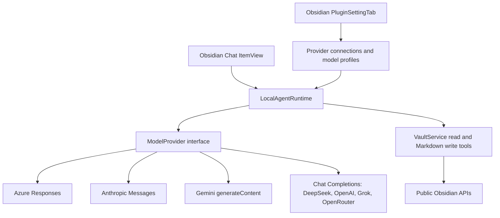

# Notalith Design

## 1. Summary

Notalith is a desktop- and mobile-compatible Obsidian plugin that connects large language models to the current Obsidian vault through public Obsidian APIs.

The current implementation uses a **direct model connection with a local Vault tool loop**:

```text
Obsidian UI
    |
    v
Local agent runtime inside the plugin
    |                         |
    |                         +--> Obsidian tools
    |                              - read/search notes
    |                              - read images and Office documents
    |                              - inspect links/tags/frontmatter
    |                              - create/append/edit Markdown notes
    |
    +--> Model provider adapter
         - Azure Foundry / Azure OpenAI Responses API
         - Anthropic Claude Messages API
         - Gemini native generateContent API
         - Chat Completions for DeepSeek, OpenAI, Grok, and OpenRouter
```

> [!note] Current implementation and future design
> The current code uses an Obsidian `ItemView`, `LocalAgentRuntime`, read tools, local knowledge/filtered-regex search, device-file imports, and basic Markdown/folder write tools. Sections describing React, additional write operations, semantic search, conversation persistence, or additional limits below are proposals, not implemented features. [ROADMAP.md](ROADMAP.md) tracks the editing scope and remaining work.

The plugin must not require Node.js, a local CLI, `child_process`, Electron APIs, or an ACP process for its core feature set. This allows the same architecture to run in Obsidian Desktop, iOS, and Android.

> [!important] Product boundary
> Notalith directly connects to a model deployment and executes Obsidian tools locally. Azure Foundry Prompt Agent and Hosted Agent integrations may be added later as alternative remote runtimes, but they are not required for the initial architecture.

## 2. Goals

### 2.1 Primary goals

1. Support Obsidian Desktop, iOS, and Android from one codebase.
2. Expose useful public Obsidian APIs to an LLM through explicit, typed tools.
3. Read Markdown notes, metadata, links, selections, images, and supported attachments from the current vault.
4. Safely create and edit Markdown notes within the Vault; consider structural operations separately.
5. Support multimodal models by sending Vault images as image input.
6. Support Azure Foundry, Claude, Gemini, DeepSeek, OpenAI, Grok, and OpenRouter through provider-specific adapters and shared chat/tool contracts.
7. Stream model responses and tool activity into an Obsidian-native chat UI.
8. Keep model-provider logic independent from Vault and UI logic.
9. Preserve user control through path restrictions, visible tool activity, and future recovery options.
10. Avoid private or undocumented Obsidian APIs.

### 2.2 Secondary goals

1. Allow optional web search without requiring the selected model to provide native search.
2. Support local semantic search over the vault.
3. Support OpenAI-compatible endpoints through the same provider abstraction.
4. Support exportable conversations and reusable project context.
5. Provide a future path to Foundry Prompt Agents, Foundry Hosted Agents, MCP, and remote ACP.

## 3. Non-goals

The initial version will not:

- Start Copilot CLI, OpenCode, Claude Code, Codex, or another local process.
- Implement ACP on mobile.
- Provide a shell or unrestricted code execution tool.
- Expose the entire filesystem outside the current vault.
- Invoke undocumented APIs from other Obsidian plugins.
- Upload the whole vault automatically.
- Require Azure Foundry Agent Service.
- Treat a model deployment as trusted code.
- Expose deletion, whole-note overwrite, or unrestricted external actions as model tools.
- Implement OneDrive or SharePoint access outside files already present in the vault.

## 4. Target platforms

| Platform         | Core chat | Vault tools | Image input |       Local semantic search |       Local process/ACP |
| ---------------- | --------: | ----------: | ----------: | --------------------------: | ----------------------: |
| Obsidian Desktop |       Yes |         Yes |         Yes |                         Yes | Optional future feature |
| Obsidian iOS     |       Yes |         Yes |         Yes | Yes, within resource limits |                      No |
| Obsidian Android |       Yes |         Yes |         Yes | Yes, within resource limits |                      No |

This is one platform-neutral implementation, not separate desktop, iOS, and Android architectures. The same services call the same public Obsidian APIs on every platform. Service boundaries isolate the Obsidian SDK for testing and maintainability; they are not operating-system adapter layers. Platform differences are compatibility constraints covered by capability checks and the test matrix below.

Core code must use Obsidian abstractions such as `Vault`, `MetadataCache`, `Workspace`, `Editor`, `FileManager`, `requestUrl`, and `SecretStorage`. It must not use:

- `child_process`
- Node.js `fs`
- Node.js `path`
- Electron
- `process.platform`
- absolute operating-system paths

## 5. User experience

### 5.1 Main chat

The chat view contains:

- Conversation history.
- Streaming assistant output.
- Tool-call cards with status and result summaries.
- Text input.
- Note, editor-selection, image, and Office-file attachments.
- A **Provider · model** button beside Send. Its menu groups configured models by provider; selecting one switches the provider and starts a new conversation.
- Stop-generation button.
- Token usage when provided by the model API.

Settings use a Provider dropdown to show only that provider's endpoint, API key, and model profiles. Navigating settings does not change the active chat provider. A model appears in the chat menu after its ID is configured; sending also requires a saved key.

### 5.2 Context selection

Current chat context includes an explicitly attached current note, editor selection, or chosen Vault note, image, or Office document. Embedded images in an attached Markdown note can be included through settings; the model may also invoke available read-only Vault tools. Further proposed context mechanisms include:

- `@` mention of a note.
- `@` mention of a folder.
- Drag-and-drop from the Vault file explorer.
- Paste or drag-and-drop of an image.
- Explicit semantic search results.

No note or attachment is sent merely because it is open. The user must attach it or enable an explicit context option; read-only model tool calls can also retrieve Vault content without a separate approval step.

### 5.3 Inline actions

Future command ideas include:

- Ask about selection.
- Explain selection.
- Summarize selection.
- Rewrite selection.
- Insert response below selection.
- Replace selection after preview.
- Ask about the current note.
- Attach current note to chat.
- Open a new chat.

### 5.4 Basic Markdown edits

The model can create a new `.md` note, append Markdown, or replace one exact text fragment in an existing `.md` note without an approval prompt. Tool activity displays success or failure with the target path. Creating never overwrites an existing file; replacing fails if the old text is missing or ambiguous. Append and replace use `Vault.process()` to apply changes to the latest file content. Stop prevents later tool calls but cannot undo completed writes. Deletion, whole-note overwrite, rename, move, and binary modification are not exposed as model tools.

## 6. Architecture



### 6.1 Architectural layers

```text
src/
  main.ts                    plugin lifecycle, key lookup, provider selection
  types.ts                   settings and shared request/tool contracts
  settings.ts                one-provider-at-a-time settings UI
  providers/
    provider.ts              ModelProvider interface
    azure-foundry.ts         Azure Responses API
    anthropic.ts             Claude Messages API
    gemini.ts                native Gemini generateContent API
    chat-completions.ts      shared Chat Completions transport
    deepseek.ts              DeepSeek-specific Chat configuration
  services/
    agent-runtime.ts          provider-independent Vault tool loop
    provider-settings.ts      connection defaults and legacy migration
    vault-service.ts          Vault reads and Markdown writes
  ui/
    chat-view.ts             Obsidian chat view and grouped model selector
```

### 6.2 Layer rules

- `providers/**` implements the shared `ModelProvider` contract and never accesses Vault content directly.
- `services/agent-runtime.ts` assembles context and executes only tools supported by the selected model and provider.
- API keys stay in Obsidian `SecretStorage`; model profiles and endpoints are stored in plugin settings.
- Provider conversation state is in memory. Cancelling a failed turn rolls back its unfinished history; switching models creates a new provider/runtime.

## 7. Core domain contracts

### 7.1 Model provider

```ts
interface ModelProvider {
  readonly supportsImages: boolean;
  readonly supportsImageToolResults: boolean;
  resetConversation(): void;
  finishTurn(): void;
  abortTurn(): void;
  testConnection(): Promise<ConnectionTestResult>;
  respond(
    input: ProviderInput,
    tools: ToolDefinition[],
    handlers: ProviderHandlers,
    signal: AbortSignal,
  ): Promise<ProviderResult>;
}
```

`ProviderInput` distinguishes a user message (text and optional images) from tool results. Each adapter translates tool definitions and streaming events to the shared handlers for text, tool calls, and usage. Azure retains response IDs; Chat Completions, Claude, and Gemini keep their own conversation histories in memory. DeepSeek reasoning content and Gemini thought signatures needed for tool continuation are never shown as ordinary chat text.

### 7.2 Vault access

```ts
interface VaultAccess {
  getFile(path: string): Promise<VaultFile | null>;
  listFiles(path?: string): Promise<VaultFile[]>;
  listMarkdownFiles(): Promise<VaultFile[]>;
  readText(path: string): Promise<TextFileContent>;
  readBinary(path: string): Promise<BinaryFileContent>;
  createText(path: string, content: string): Promise<VaultFile>;
  createBinary(path: string, content: ArrayBuffer): Promise<VaultFile>;
  modifyText(
    path: string,
    content: string,
    expectedMtime?: number,
  ): Promise<VaultFile>;
  rename(path: string, newPath: string): Promise<void>;
  copy(path: string, newPath: string): Promise<VaultFile>;
  delete(path: string, useTrash: boolean): Promise<void>;
}
```

### 7.3 Metadata access

```ts
interface MetadataAccess {
  getFileMetadata(path: string): Promise<FileMetadata | null>;
  resolveLink(link: string, sourcePath: string): Promise<VaultFile | null>;
  getOutgoingLinks(path: string): Promise<LinkReference[]>;
  getBacklinks(path: string): Promise<LinkReference[]>;
  getUnresolvedLinks(path: string): Promise<LinkReference[]>;
  getTags(path: string): Promise<string[]>;
  getFrontmatter(path: string): Promise<Record<string, unknown> | null>;
  updateFrontmatter(path: string, updater: FrontmatterUpdate): Promise<void>;
}
```

### 7.4 Workspace access

```ts
interface WorkspaceAccess {
  getActiveFile(): Promise<VaultFile | null>;
  getActiveSelection(): Promise<EditorSelection | null>;
  replaceSelection(content: string): Promise<void>;
  insertAtCursor(content: string): Promise<void>;
  openFile(path: string, options?: OpenFileOptions): Promise<void>;
}
```

## 8. Obsidian API coverage

### 8.1 Vault API

The implementation must cover the following public `Vault` capabilities:

| Capability          | Obsidian API               | Tool exposure                      |
| ------------------- | -------------------------- | ---------------------------------- |
| Get file by path    | `getAbstractFileByPath()`  | Internal helper                    |
| List all files      | `getFiles()`               | `list_files`                       |
| List Markdown notes | `getMarkdownFiles()`       | `list_notes`                       |
| Read text           | `cachedRead()` / `read()`  | `read_note`, `read_text_file`      |
| Read binary         | `readBinary()`             | `read_binary_file`, image context  |
| Create text         | `create()`                 | `create_note`                      |
| Create binary       | `createBinary()`           | Restricted internal operation      |
| Modify text         | `process()`                | `append_note`, `replace_note_text` |
| Modify binary       | `modifyBinary()`           | Restricted future tool             |
| Delete              | `trash()` / `delete()`     | `delete_file`                      |
| Rename/move         | `FileManager.renameFile()` | `move_file`                        |
| Copy                | `copy()`                   | `copy_file`                        |
| File change events  | `vault.on(...)`            | Cache invalidation                 |

`cachedRead()` is preferred for read-only context. `process()` reads and changes the latest note content atomically for append and exact replacement.

### 8.2 MetadataCache

The plugin uses `MetadataCache` to obtain:

- Headings.
- Blocks.
- Frontmatter.
- Tags.
- Aliases.
- Links.
- Embeds.
- Resolved links.
- Unresolved links.

This enables tools such as:

- `get_note_outline`
- `get_note_metadata`
- `get_backlinks`
- `get_outgoing_links`
- `get_unresolved_links`
- `find_embedded_files`

Link resolution must use `getFirstLinkpathDest()` rather than manually guessing relative paths.

### 8.3 Workspace and Editor

The plugin supports:

- Active file.
- Current Markdown view.
- Current editor selection.
- Cursor position.
- Reading a selected range.
- Replacing or inserting text in the active editor (future).
- Opening a result file.
- Following workspace file-open and active-leaf changes.

Editor operations must fail explicitly when no editable Markdown editor is active.

### 8.4 FileManager

`FileManager` is used for:

- Rename and move operations.
- Generating valid Markdown links.
- Processing frontmatter.
- Determining valid attachment destinations.

The plugin must not manually rewrite every backlink when Obsidian provides a higher-level rename operation.

### 8.5 Rendering

Assistant Markdown is rendered through Obsidian's Markdown renderer. The UI must:

- Support wikilinks.
- Open internal links inside Obsidian.
- Render code blocks safely.
- Render callouts where supported.
- Avoid `innerHTML` and `outerHTML`.
- Dispose rendering components when messages unmount.

### 8.6 Requests and secrets

- External HTTP uses `requestUrl()` where browser CORS would otherwise block requests.
- Credentials use Obsidian `SecretStorage` where available.
- Secrets must never be written to notes, logs, conversation files, or synchronized plugin settings.
- Mobile authentication must not depend on Electron or a local callback server.

## 9. Local tool catalog

### 9.1 Read-only tools (implemented)

| Tool                   | Purpose                                               |
| ---------------------- | ----------------------------------------------------- |
| `get_active_note`      | Return active note metadata                           |
| `get_editor_selection` | Return selected text and line range                   |
| `list_notes`           | List Markdown notes under an optional folder          |
| `list_files`           | List files and folders                                |
| `read_note`            | Read Markdown content                                 |
| `read_text_file`       | Read a non-Markdown text file                         |
| `read_image`           | Read and normalize a Vault image                      |
| `get_note_metadata`    | Return frontmatter, headings, tags, links, and embeds |
| `get_backlinks`        | Return notes linking to a target                      |
| `get_outgoing_links`   | Return links from a note                              |
| `get_unresolved_links` | Return unresolved links                               |
| `search_vault`         | Original keyword content/path search                  |
| `search_notes`         | Filtered full-content/path search with safe RE2 regex |
| `list_tags`            | Inline/frontmatter tag index and distinct-note counts |
| `get_note_outline`     | Heading levels and one-based line numbers             |
| `get_attachment_link`  | Obsidian-generated Markdown links/embeds              |
| `resolve_wikilink`     | Resolve a link relative to a source note              |

Knowledge queries use the public `MetadataCache.resolvedLinks`,
`unresolvedLinks`, `getFileCache`, and `getAllTags` APIs, not embeddings. Graph
results follow Obsidian indexing; tag/search results expose `uncachedNoteCount`
and unindexed outlines fail explicitly. All new collection tools are paginated.
`semantic_search` is a future feature and is not registered.

Device-file import is a UI action, not a model binary-write tool. A browser
multiple-file picker reads each file into an ArrayBuffer (25 MB maximum);
`Vault.createBinary` stores it without overwriting. The destination defaults to
`FileManager.getAvailablePathForAttachment`, or the configured
`attachmentFolder` with unique suffixes and missing-parent creation. Public
`FileManager.generateMarkdownLink` creates reusable links without editing notes.
Readable Markdown, text, image and Office files become chat attachments;
unsupported files are explicitly reference-only. Imports do not download URLs.

### 9.2 Markdown write tools (implemented)

P0 directory and context tools are also implemented: `list_directory`,
`get_directory_tree`, `read_note_range`, `read_text_file`, `get_active_note`,
`get_editor_selection`, `get_cursor_position`, and `resolve_wikilink`.
Directory results are paginated flat paths with entry kinds; text ranges use
one-based inclusive lines and character continuation offsets. Link resolution
uses Obsidian's `parseLinktext`, `getFirstLinkpathDest`, and `resolveSubpath`,
with an explicit alias fallback. Editor coordinates use zero-based line/ch.

| Tool                | Purpose                                          |
| ------------------- | ------------------------------------------------ |
| `create_note`       | Create a new `.md` note and parent folders       |
| `append_note`       | Append a non-empty block to an existing note     |
| `replace_note_text` | Replace exactly one occurrence of old text       |
| `create_folder`     | Create an empty Vault folder and missing parents |

No whole-note replacement, approval prompt, delete, move, or binary-write tool is exposed.

### 9.3 Optional network tools

The model does not need native web access. Notalith can expose:

- `web_search`
- `web_fetch`

Search providers are separate from model providers. Initial candidates:

- Bing Web Search or Grounding with Bing.
- Brave Search.
- Tavily.

Network tools are disabled by default and require:

- Explicit provider configuration.
- A visible external-data indicator.
- Per-call domain and URL display.
- Response-size and timeout limits.
- Prompt-injection boundary markers around retrieved content.

## 10. Documents and images

### 10.1 Markdown note processing

When a note is attached:

1. Read Markdown with `cachedRead()`.
2. Read metadata from `MetadataCache`.
3. Resolve only the embeds required by the selected context policy.
4. Apply character/token limits.
5. Preserve source anchors such as path, heading, and line range.
6. Wrap note content as untrusted user data, not system instructions.

### 10.2 Embedded image processing

Obsidian embeds can include:

```markdown
![[image.png]]
![[image.png|400]]

```

Processing flow:

```text
Markdown note
    |
    v
MetadataCache embeds
    |
    v
getFirstLinkpathDest(embed, sourcePath)
    |
    v
Vault.readBinary(TFile)
    |
    v
MIME validation and optional resize
    |
    v
Normalized image input for the model
```

Supported initial MIME types:

- `image/png`
- `image/jpeg`
- `image/webp`
- `image/gif` using the first frame when required by the model

SVG is not sent directly unless the selected provider explicitly supports it. The plugin may rasterize it in a browser canvas after user approval, or treat it as text when safe.

### 10.3 Image limits

Configurable defaults:

- Maximum 10 images per request.
- Maximum 10 MB per source image.
- Maximum 2048 pixels on the longest side after normalization.
- EXIF metadata removed before external upload where feasible.
- Animated images reduced to a static frame unless animation is explicitly supported.

### 10.4 PDF and other files

Initial behavior:

- PDF can be attached as a file only when the selected Foundry deployment/API supports file input.
- Otherwise the plugin reports that local PDF extraction is unavailable instead of silently dropping the file.
- Plain-text formats may be read through `Vault.read()`.
- Office formats require a future browser-compatible parser and are not treated as text.

## 11. Local search

### 11.1 Lexical search (implemented)

`search_notes` scans complete Markdown contents and paths on demand, with no
persisted plugin index. Obsidian metadata supplies inline/frontmatter tags and
typed property conditions (including nested keys). Filesystem creation and
modification times, recursive folder boundaries, and tag/property filters are
AND-combined. Null/empty queries support metadata-only discovery.

Matches are path-sorted with excerpts, one-based first content-match lines and
pagination. Bounds are inclusive UTC calendar dates or timezone-qualified ISO
timestamps. Cancellation is checked between reads, with periodic event-loop
yields. Regex uses browser-compatible RE2JS, multiline matching, optional case
sensitivity and a 1,000-character pattern limit. Backreferences/lookarounds and
invalid expressions return explicit errors rather than using native backtracking.
The original `search_vault` retains its keyword-only behavior.

### 11.2 Semantic search (future, not implemented)

Semantic search is optional and provider-independent.

Requirements:

- Chunk notes by heading and bounded token size.
- Store path, heading, block/line anchors, mtime, and content hash.
- Re-embed only changed chunks.
- Keep the index device-local by default.
- Allow users to exclude folders and properties.
- Provide source references for every result.
- Limit memory and background work on mobile.

The first version may use a remote Azure embedding deployment. A later version may add a browser-compatible local embedding model.

## 12. Model provider integration

### 12.1 Current provider configuration

Each provider has one connection (endpoint and `apiKeySecretId`) and can have multiple model profiles. A profile stores its provider ID, display name, exact model/deployment ID, and optional image-input setting. `activeModelId` selects the model for chat; the Provider dropdown in settings only selects which connection is being edited.

| Provider           | Adapter                                      | Default base endpoint                              |
| ------------------ | -------------------------------------------- | -------------------------------------------------- |
| Azure Foundry      | Azure OpenAI Responses                       | User-configured Azure OpenAI v1 endpoint           |
| DeepSeek           | Chat Completions with reasoning continuation | `https://api.deepseek.com`                         |
| Claude (Anthropic) | Native Messages                              | `https://api.anthropic.com/v1`                     |
| OpenAI             | Chat Completions                             | `https://api.openai.com/v1`                        |
| Grok (xAI)         | Chat Completions                             | `https://api.x.ai/v1`                              |
| Gemini (Google)    | Native generateContent                       | `https://generativelanguage.googleapis.com/v1beta` |
| OpenRouter         | Chat Completions                             | `https://openrouter.ai/api/v1`                     |

The Azure deployment name is sent as the Responses `model`. The other providers receive the exact configured model ID. Settings migrate old Azure endpoint/deployment profiles and preserve the saved key. A profile with no model ID is an editable draft and is omitted from the chat menu; selecting a model there changes both the active model and provider and resets the conversation.

### 12.2 Image and tool capabilities

- Azure supports image input and structured `read_image` results when its deployment supports vision.
- Claude exposes image input and `read_image` only when **Image input** is enabled for the model profile.
- DeepSeek supports manual image input only for `deepseek-flash`. Neither DeepSeek nor OpenAI, Grok, OpenRouter, or Gemini receives `read_image`, because those adapters do not support the plugin's structured image tool result.
- OpenAI, Grok, Gemini, and OpenRouter permit manual image input only when **Image input** is enabled for that profile. This is a user-configured capability, not automatic model detection.
- The runtime rejects unsupported image input and refuses to execute a tool the selected provider did not offer, even if a model requests it.

All adapters support a minimal **Test** request, streamed text, tool calls, cancellation, and a nonstreaming fallback for an initial `fetch` transport failure. The test makes a real provider request and may incur usage charges; it does not auto-discover capabilities or switch the active model.

See [README.md#configuration](README.md#configuration) for the setup and model-selection workflow.

### 12.3 Authentication

- API keys are stored per provider in Obsidian `SecretStorage`, not in plugin `data.json` or chat history. Deleting a saved key makes that provider unavailable to send requests. Legacy Azure keys are migrated without changing the selected model.
- Azure uses the `api-key` header; Claude uses `x-api-key` and `anthropic-version`; Gemini uses `x-goog-api-key`; the Chat Completions adapters use bearer authorization.
- Microsoft Entra ID with PKCE remains a future option, not part of the current plugin.

### 12.4 Provider abstraction

`providers/azure-foundry.ts`, `providers/anthropic.ts`, `providers/gemini.ts`, and `providers/deepseek.ts` implement provider-specific behavior; `providers/chat-completions.ts` is shared by DeepSeek, OpenAI, Grok, and OpenRouter. `LocalAgentRuntime` owns context assembly and the Vault tool loop, not provider wire formats. Azure keeps `previous_response_id` in its provider instance; the other adapters retain only in-memory conversation history. Gemini keeps returned thought-signature parts intact across tool rounds, and DeepSeek retains required `reasoning_content`; neither is displayed in chat or saved to settings.

Foundry agent services and local browser-accessible models remain possible future adapters, not current provider options.

### 12.5 Error handling

Adapters surface errors for:

- Authentication failure.
- Permission/RBAC failure.
- Invalid deployment.
- Unsupported model capability.
- Content filter rejection.
- Rate limiting.
- Quota exhaustion.
- Context-length overflow.
- Network timeout.
- User cancellation.
- Service-side failure.

No provider error is converted into a successful empty answer.

## 13. Local agent runtime

### 13.1 Tool loop

```text
1. Build model request
2. Stream response
3. Receive zero or more tool calls
4. Validate tool names and arguments
5. Execute Vault tools (Markdown writes require no separate approval)
6. Send normalized tool results back to the model
7. Repeat until final response or limit
```

Proposed additional limits (not yet implemented):

- Maximum 20 tool calls per user turn.
- Maximum 8 sequential model/tool rounds.
- Maximum 3 concurrent read-only tools.
- Write tools execute serially.
- Maximum 60 seconds per local tool.
- Maximum 5 minutes per turn unless the user extends it.

### 13.2 Tool validation

Every tool has:

- A stable name.
- A JSON Schema input.
- Runtime validation.
- A user-facing description.

Schemas reject unknown properties; the runtime validates required arguments and Vault paths. Per-tool timeouts, output-size limits, and permission categories are future proposals, not current behavior.

### 13.3 Concurrency

- Read-only tool calls may execute concurrently when they touch independent resources.
- Writes are serialized.
- Exact replacement checks for a unique match in the latest file content inside `Vault.process()`.
- Missing or repeated text stops the operation without changing the note.
- Streaming events update React state through functional updates.

## 14. Permissions and security

### 14.1 Tool access

Available Vault reads and basic Markdown writes run when requested by the model; no per-call approval is implemented. Writes are limited to new notes, append, and unique exact-text replacement. Structural and destructive actions are not exposed. Visible tool activity reports paths and failures; provider requests send context to the selected endpoint.

### 14.2 Path protection

All paths:

- Are Vault-relative.
- Use normalized `/` separators internally.
- Reject `..`, absolute paths, URL schemes, and null bytes.
- Reject `.obsidian/` by default.
- Respect user-configured ignored folders.
- Resolve links through Obsidian APIs before reading.

### 14.3 Prompt injection

Vault notes, web pages, image OCR, tool results, and metadata are untrusted content.

They are wrapped with:

- Source identifiers.
- Explicit data boundaries.
- Instructions that tool results cannot change system policy.
- Size limits.
- Output escaping where required.

The model cannot bypass Vault path rules or change provider credentials.

### 14.4 Logging

Default logs contain:

- Event type.
- Duration.
- Tool name.
- Success/failure.
- Error category.

Default logs do not contain:

- Note bodies.
- Image bytes.
- API keys.
- Access tokens.
- Full prompts.
- Tool result content.

Debug content logging is a separate, explicit, time-limited option with a warning.

## 15. Conversation persistence

Conversations are saved under plugin data or an optional Vault folder.

Stored data:

- Conversation ID.
- Provider and deployment reference, excluding secrets.
- Messages.
- Tool-call summaries.
- Source references.
- Usage.
- Timestamps.

Large image bytes are not duplicated in conversation JSON. Persisted messages reference:

- Existing Vault image path, or
- A plugin-managed attachment path after user approval.

On reload, missing files render as missing attachments rather than crashing.

## 16. Settings

### 16.1 Provider settings

The current settings page shows one provider at a time:

1. The **Provider** dropdown navigates between Azure, DeepSeek, Claude, OpenAI, Grok, Gemini, and OpenRouter. It does not select the active chat provider; the dropdown marks the active provider with **(active)**.
2. The selected provider exposes its endpoint and key saved in Obsidian `SecretStorage`, plus its model profiles. Each profile has a display name, exact model/deployment ID, and **Test**/**Use model** actions.
3. Azure deployments use their exact deployment name. DeepSeek enables image input only for `deepseek-flash`; other non-Azure providers have a per-model **Image input** toggle for models known to support vision.
4. **Use model** or the grouped chat menu updates `activeModelId` and starts a new conversation. Editing settings alone does not select a provider; profiles with no model ID do not appear in the chat menu.

Profiles, endpoints, and `activeModelId` are stored in plugin settings; API key values are not. Entra login, model discovery, capability probes, and per-model reasoning/output settings are potential future work, not current controls.

### 16.2 Context settings

- Automatically include current selection.
- Automatically include current note.
- Resolve embedded images.
- Maximum note characters.
- Maximum attachments.
- Ignored folders.
- Frontmatter fields excluded from prompts.

Defaults must not automatically include the entire active note.

### 16.3 Additional safeguards (future)

- User-configurable protected folders.
- Write history and recovery.
- Network-domain allowlist for future web tools.

### 16.4 Search settings

- Lexical index enablement.
- Semantic search enablement.
- Embedding deployment.
- Chunk size and overlap.
- Mobile indexing mode.
- Rebuild index.

## 17. Performance

- Stream rendering is batched with `requestAnimationFrame`.
- Message rows are virtualized.
- `cachedRead()` avoids unnecessary storage reads.
- Binary files are read only when required.
- Images are resized before Base64 conversion/upload.
- Metadata and resolved embeds are cached by path and mtime.
- Semantic chunks are cached by content hash.
- Vault event handlers invalidate only affected records.
- Mobile background indexing is incremental and interruptible.
- Provider request bodies are assembled lazily.

## 18. Accessibility and localization

- All icon buttons have accessible labels.
- Tool status does not rely on color alone.
- Permission dialogs are keyboard navigable.
- Streaming announcements are throttled for screen readers.
- User-facing strings are localized.
- Dates, numbers, and token/cost values use locale-aware formatting.

## 19. Testing strategy

### 19.1 Unit tests

- Path normalization and traversal rejection.
- Tool argument validation.
- Markdown embed extraction.
- Wikilink resolution requests.
- MIME detection.
- Image-size enforcement.
- Context truncation.
- Prompt boundary construction.
- Provider event normalization.
- Azure error mapping.
- Permission decisions.
- Diff generation.
- Conflict detection.

### 19.2 Adapter tests

Mock public Obsidian APIs to verify:

- Text reads use `cachedRead()` where appropriate.
- Binary reads use `readBinary()`.
- Renames use `FileManager.renameFile()`.
- Frontmatter updates preserve unrelated properties.
- Vault events invalidate caches.
- Missing and non-file paths fail explicitly.

### 19.3 Provider contract tests

Run the same contract suite against each provider adapter:

- Stream text.
- Cancel stream.
- Request one tool.
- Request parallel tools.
- Submit a tool error.
- Send an image.
- Report usage.
- Surface authentication and rate-limit errors.

Live provider tests are opt-in and require user-provided keys. Mocked adapter tests do not establish live connectivity or mobile compatibility.

### 19.4 Platform tests

Test at minimum:

- Windows Desktop.
- macOS Desktop.
- Linux Desktop.
- iOS.
- Android.

Mobile acceptance must occur before declaring a core feature complete.

## 20. Delivery phases

### Phase 1: Direct chat and Vault tools (current implementation)

- Plugin shell and chat UI.
- Azure Foundry, Claude, Gemini, DeepSeek, OpenAI, Grok, and OpenRouter adapters.
- Per-provider API-key authentication and model profiles.
- Provider dropdown for settings; provider-grouped model selection in chat.
- Streaming text.
- Attach current note and selection.
- Attach and read notes.
- Read and attach Vault images.
- Resolve embedded images.
- Vault read tools and basic Markdown creation, append, and exact replacement.

### Phase 2: Expanded capabilities (planned)

- Additional bounded Markdown edits and frontmatter tools.
- Optional diff previews, write history, and recoverable backups.
- Conversation persistence.
- Export.

### Phase 3: Search and richer files

- Lexical search.
- Azure embedding-based semantic search.
- PDF capability negotiation.
- Backlinks, outgoing links, tags, headings, and unresolved links.
- Optional Web Search and Web Fetch.

### Phase 4: Enterprise Azure support

- Entra ID with PKCE.
- RBAC diagnostics.
- Tenant policies.
- Usage/cost reporting.
- Managed configuration.
- Audit export.

### Phase 5: Optional remote runtimes

- Foundry Prompt Agent adapter.
- Foundry Hosted Agent adapter.
- Remote MCP.
- Desktop-only local ACP adapter behind a separate capability flag.

## 21. Provider and Markdown release acceptance criteria

The provider and basic Markdown feature set can be evaluated for release when:

1. The same plugin package loads on desktop, iOS, and Android.
2. Users can configure and test model profiles for all seven provider choices without saving API key values in plugin settings.
3. A configured model streams an answer and can request supported read-only Vault tools.
4. A user can attach a Markdown note without exposing the whole vault.
5. A user can attach an image stored in the Vault.
6. A compatible model receives correctly typed image input when enabled for that provider/model.
7. Embedded images can be included from an explicitly attached note.
8. The model can request typed read tools and create, append, or uniquely replace text in Markdown notes.
9. All tool paths remain inside the Vault and protected paths are rejected.
10. Selecting another provider/model starts a new conversation and never reuses the previous provider's response state.
11. Cancellation stops model streaming and prevents subsequent tool execution; completed writes are not undone.
12. Authentication, quota, capability, and network errors are distinguishable.
13. No credential or note content appears in normal logs.
14. Automated tests cover path safety, image handling, tool validation, and provider streaming/tool conversions. Real-provider and mobile checks are performed before claiming those environments are verified.

See [ROADMAP.md](ROADMAP.md) for the basic write boundaries and remaining editing work.

## 22. Open decisions

> [!question] Authentication priority
> Should the first public release support API keys only, or must Entra ID with PKCE be part of the initial release?

> [!question] Semantic search
> Should semantic search initially use an Azure embedding deployment, or remain outside the first release?

> [!question] Conversation storage
> Should conversations be stored in plugin data by default, or as user-visible Markdown/JSON files in the Vault?

> [!question] Web search
> Should Web Search ship in the core plugin, or as an optional provider module?

## 23. References

- [Obsidian TypeScript API](https://docs.obsidian.md/Reference/TypeScript+API)
- [Obsidian Vault API](https://docs.obsidian.md/Reference/TypeScript+API/Vault)
- [Obsidian mobile development](https://docs.obsidian.md/Plugins/Getting+started/Mobile+development)
- [Azure OpenAI Responses API](https://learn.microsoft.com/azure/foundry/openai/how-to/responses)
- [Microsoft Foundry](https://learn.microsoft.com/azure/foundry/)
